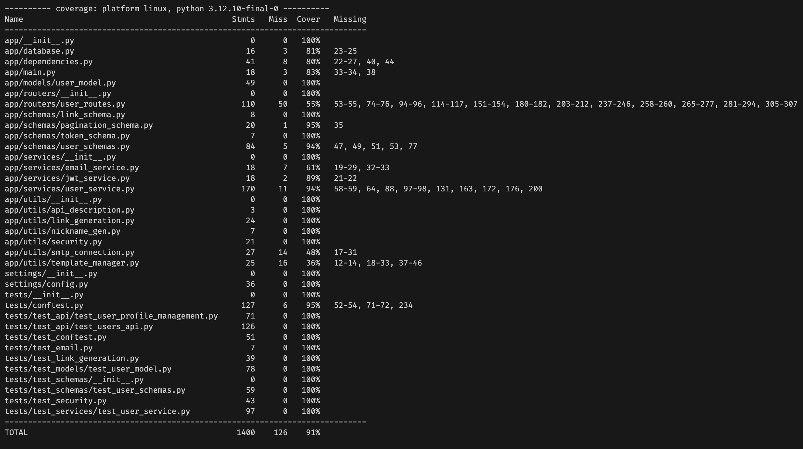
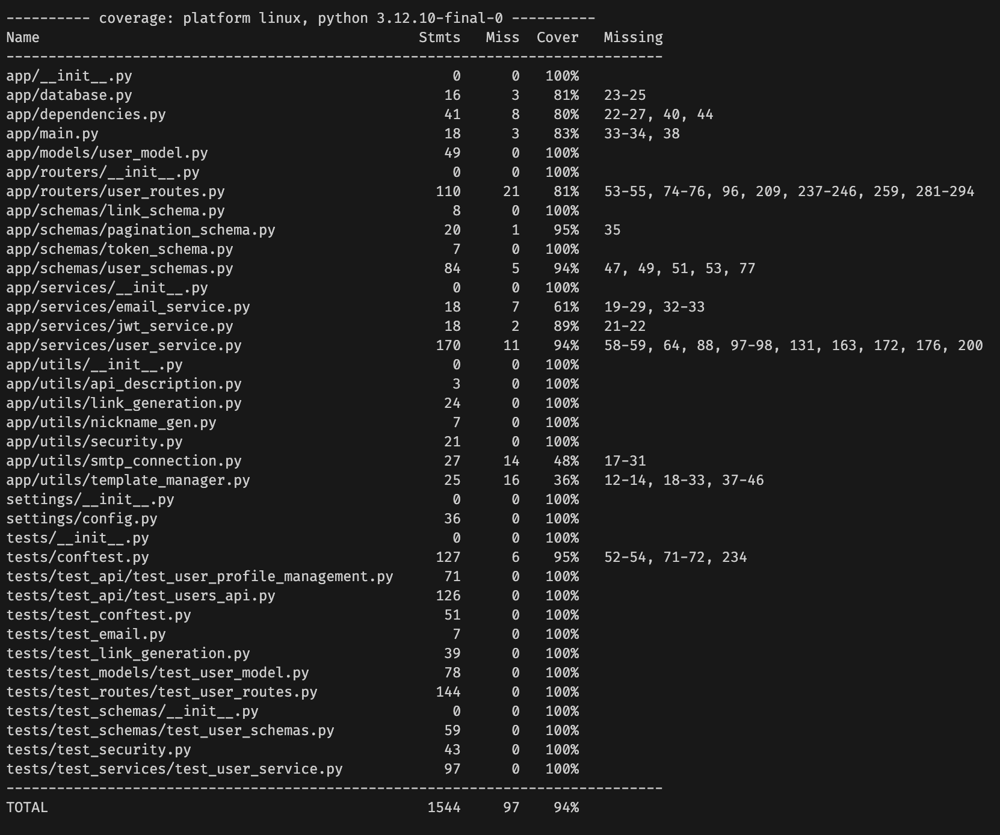

# IS 601 event management
This project is part of IS601 course. This is the final project submission.

## New feature
I selected user profile management feature to implement (feature 9).
The code for that can be seen [here](app/routers/user_routes.py).

>The code marked with "New feature" is the new code to implement this new feature.

> Corresponding tests are [here](tests/test_api/test_user_profile_management.py).

## Tests
All the new tests written can be seen [here](tests/test_api/test_user_profile_management.py). This file contains 10 new tests for new feature.  

All the new tests that were not covered originally are [here](tests/test_routes/test_user_routes.py).  
These tests increases the coverage from **91%** to **94%**.

**Before picture:**

**After picture:**

> **NOTE:** All of the new test cases pass. 

## QA
I found 5 issues, these issues are linked below.
Issues:
1. [Issue 1](https://github.com/DHJariwala/is601_user_management/issues/1)
2. [Issue 2](https://github.com/DHJariwala/is601_user_management/issues/2)
3. [Issue 3](https://github.com/DHJariwala/is601_user_management/issues/3)
4. [Issue 4](https://github.com/DHJariwala/is601_user_management/issues/4)
5. [Issue 5](https://github.com/DHJariwala/is601_user_management/issues/5)

## Dockerhub Repository Link
Dockerhub repository link is [here](https://hub.docker.com/repository/docker/dhjariwala/final_project/general).

## Rubrics

✅ New feature
✅ New tests
✅ New Issues and fixes (QA)
✅ 1-2 page document
✅ All github actions pass
✅ All tests pass